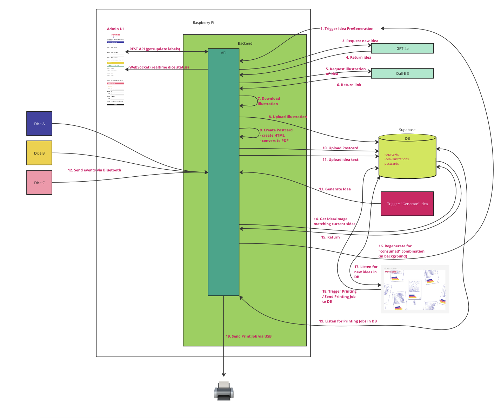

<!-- ALL-CONTRIBUTORS-BADGE:START - Do not remove or modify this section -->
[](#contributors)
<!-- ALL-CONTRIBUTORS-BADGE:END -->

# Idea Machine Backend

This code is meant to run a http server locally on a raspberry pi to orchestrate print requests
coming from the idea-machine webapp ([see here](https://github.com/technologiestiftung/idea-machine-frontend)),
handle bluetooth connections to the dices, administrate the labels of the dices, read the buzzer input 
and (pre-) generate ideas.


## Prerequisites

These are the other necessary repositories: 
- [https://github.com/technologiestiftung/idea-machine-frontend](https://github.com/technologiestiftung/idea-machine-frontend)
- [https://github.com/technologiestiftung/idea-machine-dices](https://github.com/technologiestiftung/idea-machine-dices)

If you want to run this yourself, you also need a supabase project (to store ideas) and
an openai api key (to generate ideas).  


### Install npm dependencies
If you are not in the project folder, cd into it and install dependencies:
```bash
cd idea-machine-backend && npm ci
```

### Add the .env file
Create a `.env` file in the root of the project and add the needed variables:
```bash
cp .env.example .env
```

### Run it
You can run the server with the following command:
```bash
npm run start
```

or the dev mode (watching the directory):
```bash
npm run dev
```

### Architecture / Flow

The server uses multiple technologies to handle the different tasks:

- Bluetooth to connect to the dices and receive side change events
- GPIO to read the buzzer input
- A REST API to:
  - handle read/update dice labels, 
  - live generate ideas, 
  - pregenerate ideas,
  - pick an idea from pregenerated ideas
  - regenerate pdfs (in case of design changes)
  - shutdown
  - is alive check
- WebSockets to update the connection status to the dice administration website, and listen for new printing jobs in the DB


The main flow can be visually represented as follows:




### How are the ideas generated?

The ideas are generated using gpt-4o and dall-e 3. 
A prompt is sent to the gpt-4o model, and the output is sent to the dall-e model to generate an image.
The idea text and idea image are then used to generate an HTML (postcard), which is then converted to a PDF (postcard).

### How do you connect to dices via bluetooth?

You first need to pair the dices with the raspberry pi. 
You can do this by running the following command:
```bash
bluetoothctl
```

Then, in the bluetoothctl console, run the following commands:
```bash
scan on
```

You should see the dices in the list of devices.
Then, pair the dice with the following command:
```bash
pair <MAC_ADDRESS_OF_DICE>
```


## Contributing

Before you create a pull request, write an issue so we can discuss your changes.

## Contributors

Thanks goes to these wonderful people ([emoji key](https://allcontributors.org/docs/en/emoji-key)):

<!-- ALL-CONTRIBUTORS-LIST:START - Do not remove or modify this section -->
<!-- prettier-ignore-start -->
<!-- markdownlint-disable -->
<table>
  <tbody>
    <tr>
      <td align="center" valign="top" width="14.28%"><a href="https://github.com/raphael-arce"><br /><sub><b>Raphael.A</b></sub></a><br /><a href="https://github.com/technologiestiftung/idea-machine-printing-server/commits?author=raphael-arce" title="Code">💻</a>  <a href="https://github.com/technologiestiftung/idea-machine-printing-server/pulls?q=is%3Apr+reviewed-by%3Araphael-arce" title="Reviewed Pull Requests">👀</a> <a title="Ideas, Planning, & Feedback">🤔</a></td>
      <td align="center" valign="top" width="14.28%"><a href="https://github.com/dnsos"><br /><sub><b>Dennis Ostendorf</b></sub></a><br /><a href="https://github.com/technologiestiftung/idea-machine-printing-server/commits?author=dnsos" title="Code">💻</a></td>
      <td align="center" valign="top" width="14.28%"><a href="http://annaeschenbacher.com"><br /><sub><b>aeschi</b></sub></a><br /><a href="https://github.com/technologiestiftung/idea-machine-printing-server/commits?author=aeschi" title="Code">💻</a> <a title="Design">🎨</a> <a href="https://github.com/technologiestiftung/idea-machine-printing-server/pulls?q=is%3Apr+reviewed-by%3Aaeschi" title="Reviewed Pull Requests">👀</a> <a title="Ideas, Planning, & Feedback">🤔</a></td>
    </tr>
  </tbody>
</table>

<!-- markdownlint-restore -->
<!-- prettier-ignore-end -->

<!-- ALL-CONTRIBUTORS-LIST:END -->

This project follows the [all-contributors](https://github.com/all-contributors/all-contributors) specification. Contributions of any kind welcome!

## Credits

<table>
  <tr>
    <td>
      Made by <a href="https://citylab-berlin.org/de/start/">
        <br />
        <br />
        
      </a>
    </td>
    <td>
      A project by <a href="https://www.technologiestiftung-berlin.de/">
        <br />
        <br />
        
      </a>
    </td>
    <td>
      Supported by <a href="https://www.berlin.de/rbmskzl/">
        <br />
        <br />
        
      </a>
    </td>
  </tr>
</table>

## Related Projects

https://github.com/technologiestiftung/idea-machine-frontend

https://github.com/technologiestiftung/idea-machine-dice
